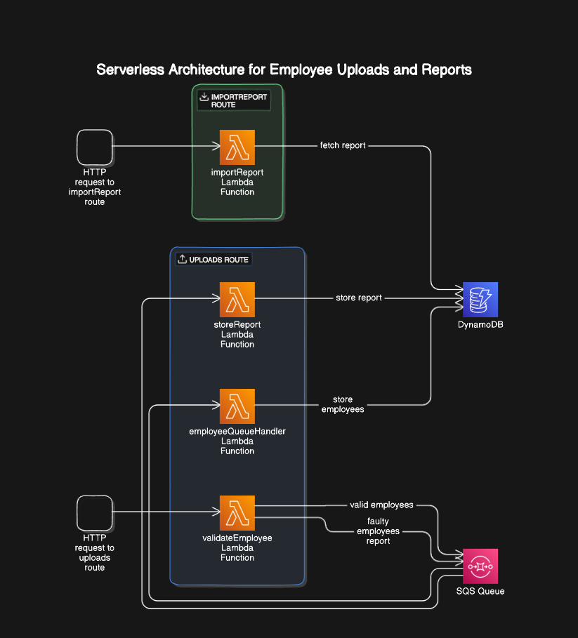

# Employee-Api

## Architectual Overview



## Api Description

We have 2 Routes:

1. uploads: It expects an array of employees and returns after finished the importId. Example Request Body:
    
`````
{
    "employees": "employees": [
        {
            "firstName": "Ann",
            "lastName": "Mendoza",
            "phone": "586.306.4010",
            "employeeId": "0baedee2-74c9-41ab-93b6-5d3252de3b6d"
        },
        {
            "firstName": "Sarah",
            "lastName": "",
            "phone": "+1-520-374-7006x2762",
            "employeeId": "f69d3812-08dd-4f96-b131-243f69bf7619"
        },
    ]
}
`````

2. importReport: It expects importId to fetch the report from dynanmoDb and return it

## Things to Improve

- With more time I would like to extend the testing capabilities to increase confidence in changes
- Improve scalibility: Right now the amount of Employees to be handled are limited by the message length the queue can handle for reports. By using compression I increased the amount but to scale indefinitly I would like to change on how I am handling the error reports (splitting each error as single message and batchingt them and afterwards retrivieng all errors via importId and creating the report afterwards as an example)
- Adding Swagger Docs to have nice Api Documentation from the getg-o